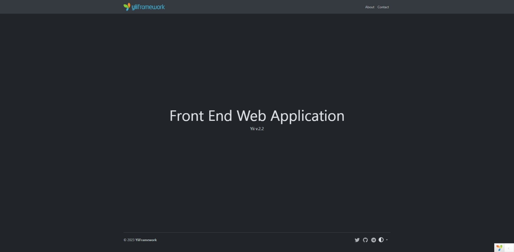
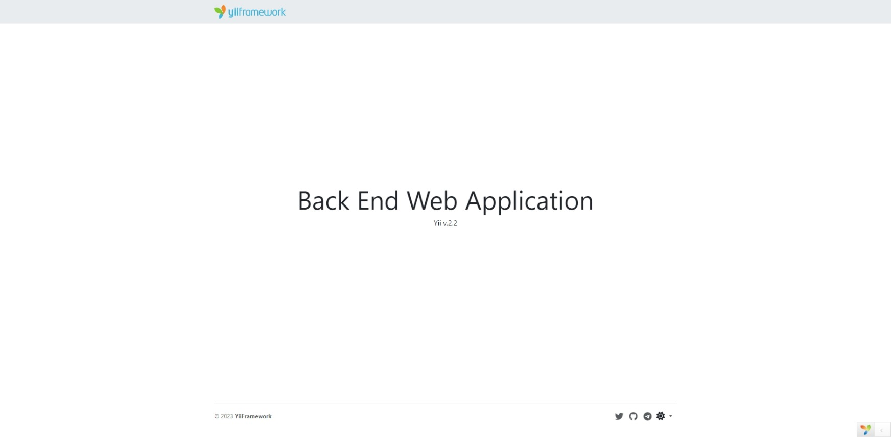

<p align="center">
    <a href="https://github.com/yii2-extensions/app-advanced" target="_blank">
        
    </a>
    <h1 align="center">Web Application Advanced</h1>
    <br>
</p>

<p align="center">
    <a href="https://www.php.net/releases/8.1/en.php" target="_blank">
        
    </a>
    <a href="https://github.com/yiisoft/yii2/tree/2.2" target="_blank">
        
    </a>
    <a href="https://github.com/yii2-extensions/app-advanced/actions/workflows/build.yml" target="_blank">
        
    </a>
    <a href="https://codecov.io/gh/yii2-extensions/app-advanced" target="_blank">
        
    </a>    
    <a href="https://github.com/yii2-extensions/app-advanced/actions/workflows/static.yml" target="_blank">
        
    </a>
    <a href="https://github.com/yii2-extensions/app-advanced/actions/workflows/static.yml" target="_blank">
        
    </a>
    <a href="https://github.styleci.io/repos/706767349?branch=main" target="_blank">
        
    </a>    
</p>

</br>



</br>



</br>

## Directory structure

```text
root
├── config  
│   ├── backend                 Backend configuration.            
│   ├── console                 Console configuration.
│   ├── frontend                Frontend configuration.
│   ├── config-plugin.php       Plugin configuration.
│   ├── messages.php            Translation configuration.
│   ├── params-backend.php      Backend parameters.
│   ├── params-console.php      Console parameters.
│   ├── params-frontend.php     Frontend parameters.
│   └── params.php              Common parameters.
├── backend             
│   ├── config                  Backend tests configuration.
│   ├── public                  Backend web server public.
│   ├── src                     
│   │   └── UseCase
│   │       └── Site            Site use case.
│   └── Tests                   Backend tests.
├── common             
│   └── src                     
│       └── Framework           
│           └── Asset           Common asset bundles files.    
│           └── Controller      Common controller files.
│           └── resource         
│               ├── css         Common Css files.
│               ├── js          Common Js files.
│               ├── layout      Common Layout files.
│               └── message     Common Translation files.
├── console             
│   ├── config                  Console tests configuration.
│   └── src                     
│       ├── UseCase
│       │   └── Hello           Hello use case.
│       └── Tests               Console tests.
├── frontend             
│   ├── config                  Frontend tests configuration.
│   ├── public                  Frontend web server public.
│   └── src                     
│       ├── Framework           
│       │   ├── EventHandler    Event handler files.
│       ├── UseCase
│       │   ├── About           About use case.
│       │   ├── Contact         Contact use case.
│       │   └── Site            Site use case.
│       └── Tests               Frontend tests.
└── vendor                      Composer dependencies.

```

## Installation

<p align="justify">
If you do not have <a href="http://getcomposer.org/" title="Composer" target="_blank">Composer</a>, you may install it by following the instructions at <a href="http://getcomposer.org/doc/00-intro.md#installation-nix" title="getcomposer.org" target="_blank">getcomposer.org</a>.
</p>

You can then install this project app-basic using the following command:

```shell
composer create-project --prefer-dist --stability=dev yii2-extensions/app-advanced myapp
```

<p align="justify">
Now you should be able to access the application advanced through the following URL, assuming `frontend/public` amd `backend/public` is the directory
directly under the Web root.
</p>

__*Virtual Host:*__

```
http://localhost:8080/
```

__*Server Yii:*__

```shell
./yii serve -t backend/public -r backend/public/index.php
./yii serve -t frontend/public -r frontend/public/index.php
```

__Console commands:__

```shell
./yii hellow/index
```

## Tests

~~~
// download all composer dependencies root project
$ composer update --prefer-dist -vvv

// run all tests with code coverage
$ vendor/bin/codecept run --coverage-xml
~~~


## Our social networks

[](https://twitter.com/Terabytesoftw)

## License

The MIT License. Please see [License File](LICENSE.md) for more information.
